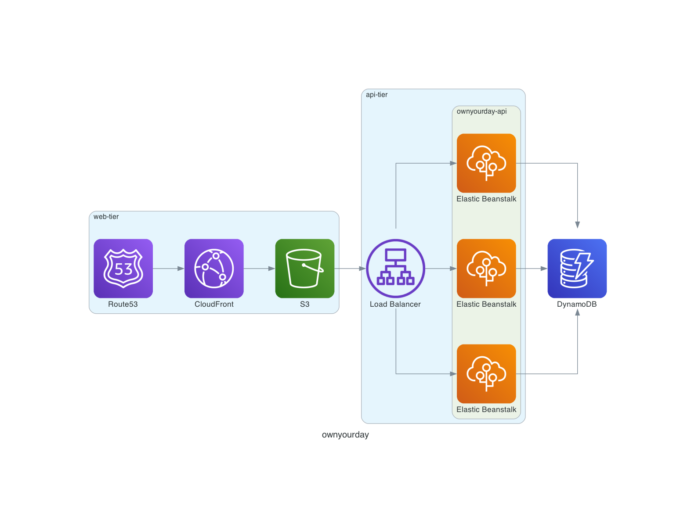

# Ownyourday

Ongoing rewrite of [ownyourday](https://www.ownyourday.ca). This is a work in progress.

## Overview

### The product

Ownyourday is a daily goal-tracking application.
Users set goals on a weekly schedule (e.g., "go for a run 3 times this week" or "read a book every day").
From there, they complete their goals via the interface.
Their progress and goal streak is tracked as a result.
Ad-hoc one-off tasks are supported to provide a daily to-do list as well.

### The architecture

This application will be hosted on AWS.
Terraform declarations are available from the `terraform` directory.
A diagram is generated via script in the `tools/diagram` subdirectory:

## Project dependencies

Ownyourday is built with an `nx` monorepo. Hence, you'll need:

- `node >= 18`
- `yarn`

## Project setup

### Developing

TODO

### Operating

TODO
